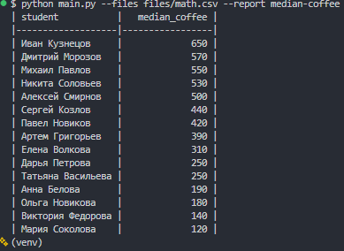
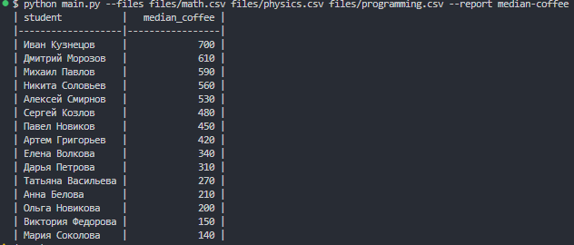

## Student Reports

Скрипт формирует отчет `median-coffee`: медианные траты на кофе по каждому
студенту на основе одного или нескольких CSV‑файлов.

### Требования
- Python 3.12+
- `tabulate` (для вывода таблицы)
- `pytest` (для тестов)

### Установка зависимостей
```bash
pip install -r requirements.txt
```

### Пример запуска
```bash
python main.py --files files/math.csv --report median-coffee
python main.py --files files/math.csv files/physics.csv files/programming.csv --report median-coffee
```

### Скриншоты вывода




